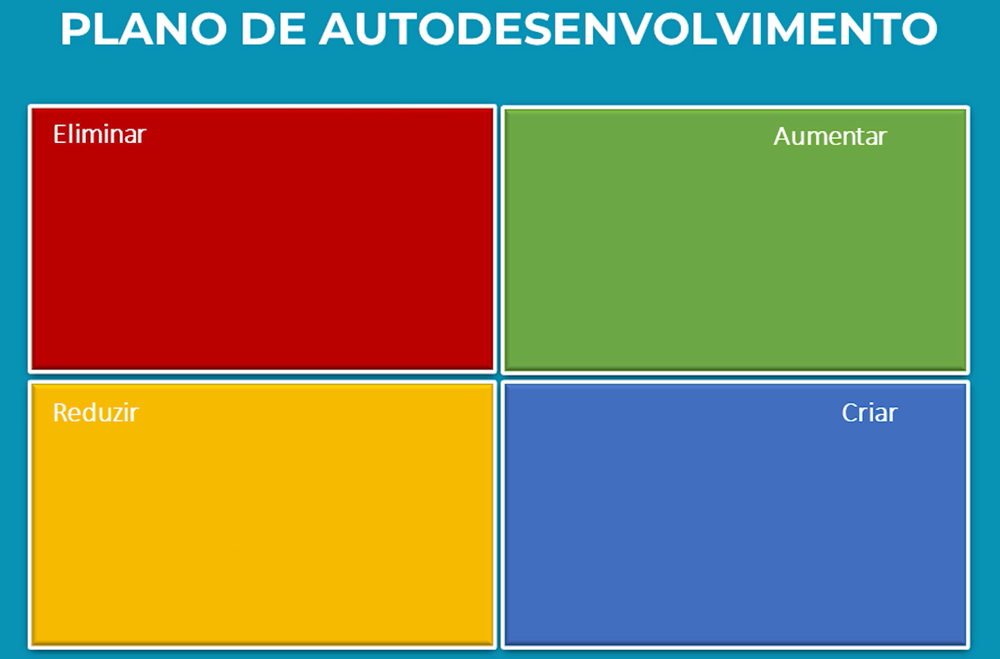
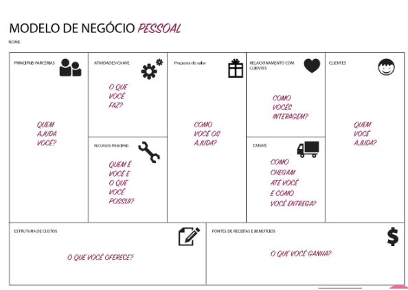
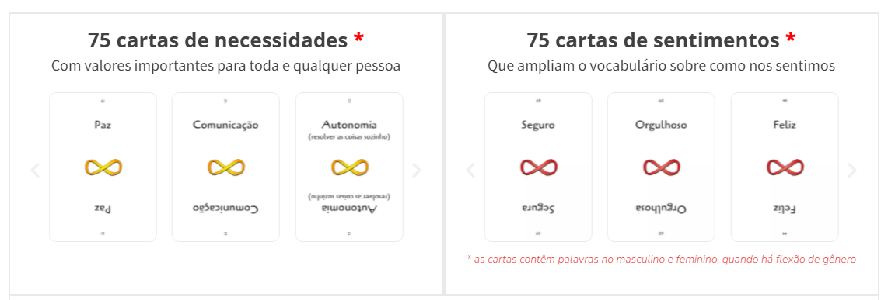
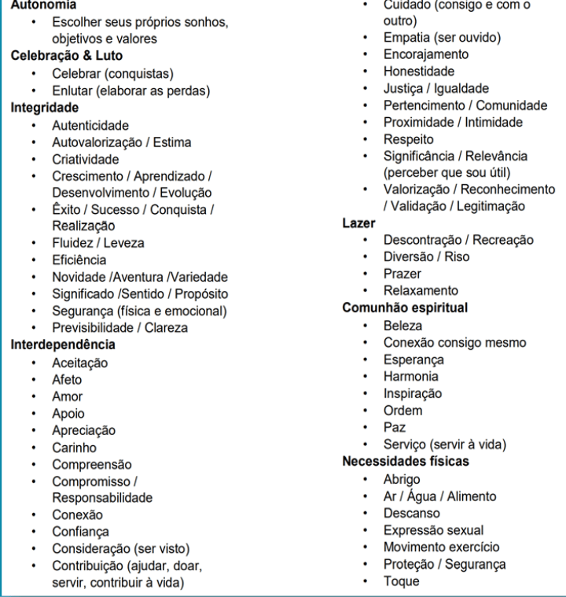
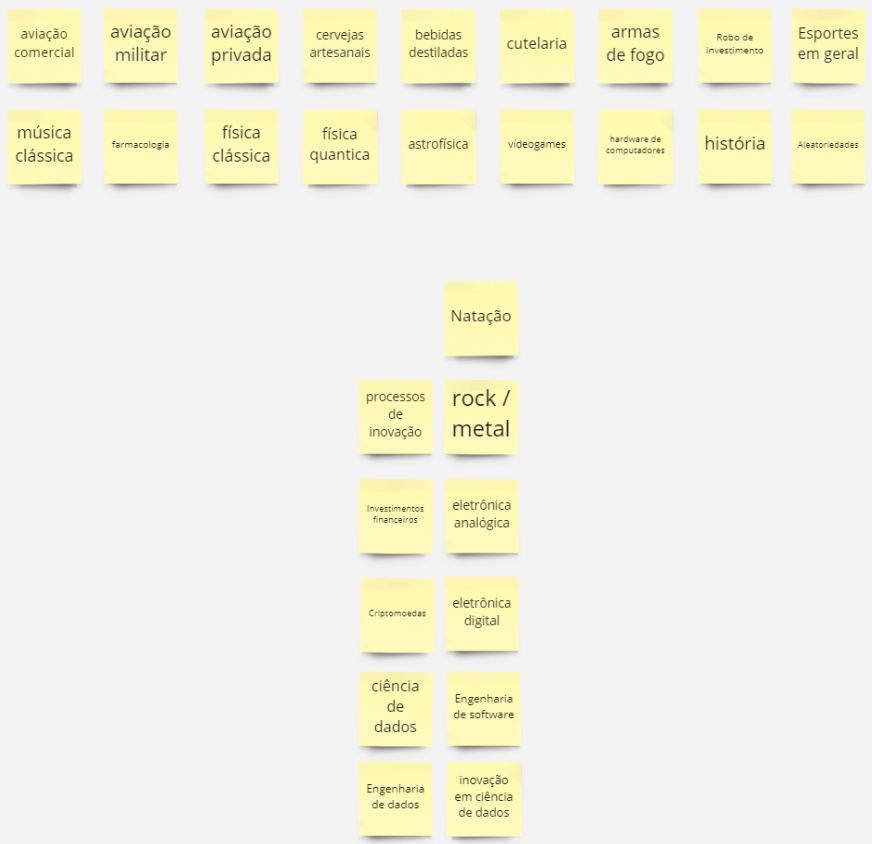
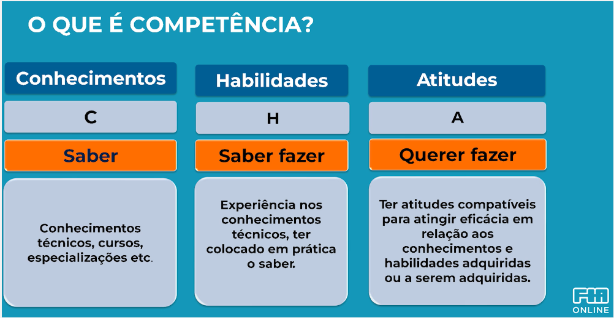

- [New Lead Tools](#new-lead-tools)
- [Processos de entrevistas](#processos-de-entrevistas)
  - [Visão sistêmica](#visão-sistêmica)
  - [Orientação estratégica](#orientação-estratégica)
  - [Resiliência](#resiliência)
  - [Avaliação técnica](#avaliação-técnica)
- [Reuniões individuais](#reuniões-individuais)
  - [Pergunta reflexivas](#pergunta-reflexivas)
    - [Atualização contínua](#atualização-contínua)
    - [Motivadores e desmotivadores](#motivadores-e-desmotivadores)
    - [Reforço da orientação estratégica](#reforço-da-orientação-estratégica)
    - [Plano de desenvolvimento individual](#plano-de-desenvolvimento-individual)
    - [Desenvolvimento de protagonismo](#desenvolvimento-de-protagonismo)
    - [Plano de desenvolvimento profissional](#plano-de-desenvolvimento-profissional)
    - [Business model you](#business-model-you)
    - [Visão de objetivos profissionais](#visão-de-objetivos-profissionais)
    - [Acompanhamento do atingimento de objetivos profissionais](#acompanhamento-do-atingimento-de-objetivos-profissionais)
    - [Definição de Sucesso](#definição-de-sucesso)
  - [Perguntas situacionais](#perguntas-situacionais)
    - [Follow up de projetos](#follow-up-de-projetos)
    - [Feedback](#feedback)
    - [Alinhamento de expectativas](#alinhamento-de-expectativas)
    - [Reflexões sobre evolução da empresa](#reflexões-sobre-evolução-da-empresa)
- [Dinâmicas em grupo](#dinâmicas-em-grupo)
  - [Reforço da visão sistêmica](#reforço-da-visão-sistêmica)
  - [Spotify health check](#spotify-health-check)
  - [Mapeamento do projeto VUCA](#mapeamento-do-projeto-vuca)
  - [GROK](#grok)
  - [BIG T](#big-t)
  - [Speedback STAR Positivo](#speedback-star-positivo)
  - [Protagonismo dentro do time](#protagonismo-dentro-do-time)
- [Organização de reuniões e construção de confiança](#organização-de-reuniões-e-construção-de-confiança)
  - [Check in](#check-in)
  - [Contexto](#contexto)
  - [Feedback](#feedback-1)
  - [Ambiente virtual](#ambiente-virtual)
- [Conhecendo cada pessoa do time](#conhecendo-cada-pessoa-do-time)
  - [MBTI](#mbti)
  - [Inteligência positiva](#inteligência-positiva)
- [Feedback](#feedback-2)
  - [Feedback formal](#feedback-formal)
  - [Feedback informal](#feedback-informal)
- [Preparação de sucessores](#preparação-de-sucessores)
  - [Dicas para o processo sucessório](#dicas-para-o-processo-sucessório)
- [Avaliação de desempenho](#avaliação-de-desempenho)
  - [Conhecimentos habilidades de atitudes (CHA)](#conhecimentos-habilidades-de-atitudes-cha)
  - [9box](#9box)
- [Definições de trilhas de aprendizado](#definições-de-trilhas-de-aprendizado)

# New Lead Tools
Ferramentas para ajudar a direcionar o dia a dia de um novo líder

O objetivo deste repositório é compartilhar diversas ferramentas que podem ser utilizadas por pessoas que estão assumindo um papel de liderança de forma recente, principalmente ajudar pessoas que estão realizando uma transição de carreira de uma área técnica para uma área de gestão, aqui pretendo trazer diversas ferramentas que venho utilizando nesse meu processo, que estão me ajudando e estão sendo úteis no meu dia a dia. 

A ideia é que esse material tenha um cunho mais prático, sem o intuito de substituir cursos na área de gestão. Chamo o que vou colocar aqui de ferramentas pois são técnicas que estou desenvolvendo e extraindo de uma formação no curso [Liderança e Gestão Estratégica de Pessoas](https://www.fiaonline.com.br/pos/lideranca-e-gestao-estrategica-de-pessoas) que estou realizando pela [FIA](http://www.fiaonline.com.br), além da experiência que estou tendo também de forma prática.
# Processos de entrevistas
Uma das primeiras atribuições de um novo líder é a sua participação de forma mais ativa dentro de processos seletivos para a construção de novos times. Nesse momento passa a ser necessário além de uma avaliação técnica, também começar a prestar atenção em alguns pontos comportamentais da pessoa que está sendo entrevistada, como ferramentas para esse ponto temos alguns tipos de perguntas que podem ser úteis.

## Visão sistêmica
A visão sistêmica é a capacidade que uma pessoa tem de perceber que o que ela desenvolve faz parte de um todo maior. O exemplo mais didático que ilustra o tema é dos três pedreiros que estavam assentando tijolos, o primeiro diz que está assentando tijolos, o segundo que está construindo uma parede e o terceiro fala que está construindo uma casa, a moradia de uma pessoa. Todos estão fazendo a mesma tarefa, mas o que muda é a visão sobre o que essa tarefa significa. 

Normalmente pessoas que possuem a capacidade da visão sistêmica conseguem se motivar de forma mais fácil, pois entendem o propósito maior daquela pequena tarefa que está realizando. 

Para conseguir perceber a visão sistêmica, é possível fazer perguntas como:
- O que você faz no seu trabalho atual? 
- Qual o impacto das atividades que você realiza?

## Orientação estratégica
Aqui entra a percepção da capacidade da pessoa em trabalhar de forma alinhada com a visão, missão e valores da empresa, neste ponto é um pouco mais simples de entender, algumas perguntas diretas sobre esse tema:
- Você conhece a missão, visão e valores da sua empresa atual?
- Se sim, dos valores da sua empresa atual, com qual você mais se identifica? Por quê?

## Resiliência
A resiliência é a capacidade que uma pessoa tem de não desistir, mesmo diante a adversidades, uma das situações em que pode perceber a resiliência de uma pessoa é em relação a convencimento de outras pessoas, então para esse ponto podemos trabalhar com perguntas como:
- Me conta uma situação na qual você precisou convencer uma pessoa sobre alguma coisa.
- Como essa pessoa reagiu nesse momento?
- O que mais você precisou fazer para convencer a pessoa?
- Como essa pessoa reagiu quando você fez isso também?

## Avaliação técnica
Para a avaliação técnica venho tentando uma série de alternativas:
- Provas técnicas com desenvolvimento de desafio parecido com o que a pessoa irá encontrar no dia a dia.
  - Essa é uma abordagem que funciona bastante, você consegue pegar bastante da forma com que a pessoa trabalha, porém tem um ponto que a adesão a ela está sendo cada vez menor, com os candidatos abandonando o processo devido a isso.
- Desenvolvimento de questões em tempo real
  - Essa abordagem também é boa no sentido de entender a forma de raciocínio da pessoa, porém ela demanda muito tempo do entrevistador, e muitas pessoas já estão nervosas de estar em um processo seletivo, e ao solicitar que ela desenvolva um código na hora pode gerar um bloqueio na pessoa, e ela não conseguir mostrar do que realmente é capaz.
- Code Review
  - Essa abordagem tem se tornando a minha favorita durante o processo de entrevista, com ela eu desenvolvi um código, que eu tenho noção de quais pontos existe uma possível melhoria, e então solicito para que o candidato me explique o que o código está fazendo e faça alguma sugestão de melhorias, a depender do que o candidato responde, é possível entender o nível de senioridade dele, primeiro no entendimento de código desenvolvido por outra pessoa, e depois nos pontos de sugestão de melhoria. Vem se demonstrando a forma mais simples de realizar a avaliação técnica dos candidatos. Recentemente encontrei também [este artigo](https://freakingrectangle.com/2022/04/15/how-to-freaking-hire-great-developers/) que endossa essa estratégia, inclusive sugerindo algumas estratégias para aplicar a presente técnica.
  
# Reuniões individuais

A Reunião individual com cada liderado é uma ferramenta extremamente poderosa para criar a relação entre o líder e os liderados, pois é o momento em que irá permitir que o líder ajude o liderado em direcionamentos de carreira, e ajude a moldar capacidades comportamentais. 

Normalmente algo entre 20 a 40 minutos semanalmente pode ser suficiente, porém é importante validar junto ao time e testar várias configurações de duração até encontrar algo que seja ótimo. Lembrando que também pessoas diferentes tem necessidades de tempos diferentes individuais, é sempre importante ajustar de acordo com a necessidade de cada um.

Outro ponto é saber ponderar entre questionamentos reflexivos e questionamentos situacionais, as ferramentas reflexivas são muito poderosas, mas se forem utilizadas de forma muito frequente, pode desanimar o liderado.
## Pergunta reflexivas
### Atualização contínua
É sempre importante provocar para que os liderados sempre se mantenham atualizados, uma forma interessante é utilizando a seguinte pergunta:
- Qual o prazo de validade do seu conhecimento? 
- Em quanto tempo esse conhecimento irá se tornar obsoleto? 

### Motivadores e desmotivadores
Para entender o que motiva ou desmotiva as pessoas dentro do seu time, é possível utilizar a experiência passada dos liderados, com algumas perguntas:

- Me conte sobre o projeto mais legal que você trabalhou nas suas experiências anteriores, o projeto que mais te marcou de forma positiva?
- Nesse projeto o que mais te marcou? Foi uma atuação do gestor? Foi um desafio novo? Foi o resultado? 
- Comparando com a nossa empresa atual, o que nós temos de semelhante a esse projeto?
- O que na sua opinião faz sentido nós trazermos desse projeto para a nossa empresa?

Com essas questões é possível extrair de forma simples o que motiva o seu liderado dentro do dia a dia de trabalho, da mesma forma temos algumas questões que nos trazem os pontos que geram uma desmotivação.
- Agora me conta sobre um projeto que foi frustrante de se trabalhar.
- O que mais te marcou nesse projeto?
- Você consegue visualizar alguma semelhança desse projeto com a nossa empresa atual?
- O que nós podemos mudar no nosso time/empresa para que esse tipo de situação não ocorra aqui?

### Reforço da orientação estratégica
Pedir para que o liderado complete as frases:
- EU {INSERIR AQUI A MISSÃO DA EMPRESA} através de ... por que ...

Para cada um dos valores da empresa:
- Eu vejo a nossa empresa sendo {VALOR DA EMPRESA} na situação ... por que ...
- Eu vejo que na nossa empresa falta {VALOR DA EMPRESA} na situação ... por que ... 
- Com base nisso tudo que você me falou aqui, qual o ponto que gera mais impacto, na sua opinião para o nosso time?

Nessa conversa o papel do líder é essencial, visto que é o momento em que o líder será capaz de demonstrar qual a sua percepção sobre cada um dos valores da empresa, e quais as ações que a empresa vem executando com a finalidade de fortalecer um determinado valor. 

Nesse momento a área de Recursos Humanos ou Pessoas e Cultura, pode ser consultada antes da dinâmica, te garanto que vão adorar falar sobre o tema com você.

### Plano de desenvolvimento individual
O plano de desenvolvimento deve ser criado pelo próprio liderado, porém o líder tem o papel de provocar o liderado à reflexão sobre isso, uma boa maneira de realizar essa reflexão é olhando para uma linha do tempo, com perguntas como:
- Como se deu o seu crescimento profissional até o momento?
- Em quais momentos você se sentiu valorizado? 
- O que houve de especial nesse momento?
- Quem reconheceu o que você fez? E fora do ambiente de trabalho?
- Dentro desse crescimento profissional, para qual direção você gostaria de apontar a sua carreira?
- Como eu posso te ajudar a seguir nessa direção?
- Você consegue enxergar aqui dentro do nosso dia a dia alguma forma de encaixarmos esse seu plano?

### Desenvolvimento de protagonismo
Uma das habilidades mais desejadas em times de alto desempenho é que tenha um protagonismo dos membros do time, nesse aspecto é importante definir junto com cada liderado o que é ser protagonista.

Eu tenho uma frase que gosto muito para definir o que é uma pessoa protagonista:
- Aquela pessoa que faz com qualidade, o que precisa ser feito, na hora que precisa ser feito, sem que ninguém precise mandar fazer, e está disposto a ensinar os outros a fazer também.
  
Tendo essa definição em mente é possível trabalhar com cada liderado individualmente através de perguntas como:
- O que é um protagonista dentro do time, na sua opinião?
- Só pode ter um protagonista dentro do time? (Spoiler: todos do time podem ser protagonistas)
- O que você acha que precisa fazer para aumentar o seu protagonismo dentro do time?
- Se você está em uma reunião e não falou nada durante a reunião, faz sentido ter participado dessa reunião?

### Plano de desenvolvimento profissional
Um pouco diferente do plano de desenvolvimento pessoal, o plano de desenvolvimento profissional deve ser aplicado olhando para o cargo atual do liderado, com o objetivo de que ele se torne um profissional cada vez melhor dentro da sua área de conhecimento.

Para isso pode montar um quadrante gráfico com 4 áreas.

E para cada quadrante o liderado deverá adicionar no mínimo uma resposta.
- O que eu preciso **ELIMINAR** nos meus comportamentos e práticas para que eu possa ser um {INSERIR NOME DA FUNÇÃO EXERCIDA AQUI} melhor?
- O que eu preciso **AUMENTAR** nos meus comportamentos e práticas para que eu possa ser um {INSERIR NOME DA FUNÇÃO EXERCIDA AQUI} melhor?
- O que eu preciso **REDUZIR** nos meus comportamentos e práticas para que eu possa ser um {INSERIR NOME DA FUNÇÃO EXERCIDA AQUI} melhor?
- O que eu preciso **CRIAR** nos meus comportamentos e práticas para que eu possa ser um {INSERIR NOME DA FUNÇÃO EXERCIDA AQUI} melhor?

### Business model you
O business model you é uma adaptação do business model canvas e é uma ferramenta bastante poderosa no sentido de desenhar quais relacionamentos são os principais dentro de uma empresa para auxiliar a atingir seus objetivos profissionais.

Esse canvas é inicialmente proposto para desenvolver parcerias com clientes, mas também pode ser utilizado pensando com foco em pessoas dentro da sua empresa que podem ajudar a atingir uma determinada meta ou objetivo. 

Para maiores informações sobre como preencher o canvas, podem acessar o [site do qual peguei essa imagem que ilustra o contexto](https://www.mariaaugusta.com.br/business-model-you-um-metodo-para-reinventar-a-carreira-e-a-si-mesmo/) ou também pode ter acesso de uma forma mais detalhada com o livro que trouxe essa proposta: *Business model you: o modelo de negócios pessoal* do autor *Tim Clark*. 

Essa ferramenta pode ser utilizada também em dinâmicas de grupos, no qual se desenha o canvas personificando o time, levantando quais outras áreas podem ajudar o time a desenvolver o que precisa, quem o time ajuda com esse projeto, qual a proposta de valor do projeto, e o que o time ganha com esse projeto.

### Visão de objetivos profissionais
Parte do PDI é o liderado ter claro para si qual seu objetivo profissional, para que com isso o líder tenha a capacidade de auxiliar nesse processo, de forma com que fique mais fácil que esse objetivo seja atingido. 

Para esse ponto é muito importante que o líder tenha claro qual o seu próprio objetivo profissional, de forma que o líder tenha a capacidade de utilizar a sua própria trajetória como exemplo. Também exige uma visão do líder do mercado de trabalho atual para que tenha subsídios caso o liderado solicite ajuda na definição dessa trilha.

Essa é uma dinâmica que exige uma certa reflexão, e muitos não tem a resposta na hora que são perguntados, então pode ser útil dar um tempo para que os liderados reflitam sobre esse questionamento, podendo em uma semana lançar a pergunta principal e na próxima semana discutir sobre ela:
- Qual o seu objetivo pessoal?

Na semana seguinte, com o liderado tendo tempo para refletir, pode começar com uma conversa com algumas perguntas:
- Por que esse é o seu objetivo?
- Como você pretende atingir esse objetivo?
- Quem pode te ajudar a atingir esse objetivo?
- Vamos montar um Business Model You com foco nesse objetivo?
- O que eu posso fazer para facilitar esse seu objetivo?

### Acompanhamento do atingimento de objetivos profissionais
Uma vez definidos os objetivos profissionais de cada colaborador, é importante de tempos em tempos fazer o colaborador refletir em relação ao quanto ele está evoluindo para atingimento das suas metas.

Nesse caso o que pode ser utilizado é iniciar a conversa pedindo para que o colaborador relembre seus objetivos e ordene em uma escala de 0 a 10, o quão próximo ele está de atingir cada um dos seus objetivos. 

Para cada objetivo citado o papel do líder é de buscar entender como ele pode ajudar a atingir aquele determinado objetivo, e como podem ser criadas situações dentro do ambiente de trabalho e dentro do dia a dia do time que facilitem que o profissional atinja seus objetivos.

### Definição de Sucesso
Para criar um ambiente de alta confiança com o liderado, uma das formas de fazer isso é construir uma visão de sucesso, entender junto ao liderado o que é sucesso para ele, e demonstrar que essa visão de sucesso que ele possui está ligado ao que a companhia considera sucesso também. 

Uma forma simples de fazer isso é começar com o liderado dentro da reunião individual a construir a definição de sucesso, e para isso o gestor também precisa ter bastante claro para si a respostas das perguntas, que são bastante pessoais, e ao provocar o liderado a responder, o gestor também deve compartilhar com o liderado as suas respostas, pois assim aumenta o nível de confiança do liderado no gestor.

Algumas perguntas para guiar a conversa:

- O que você considera como sucesso no seu ambito pessoal?
- O que você considera como sucesso na sua posição de trabalho atual? 
- Como você definiria que sua carreira foi bem sucedida? 
- O que você acredita que seria sucesso para o time em que você está envolvido hoje?
- O que você acredita que seria sucesso para a empresa como um todo? 

Essas perguntas tendem a gerar uma identidade comum, e a partir do momento em que o colaborador entende que a visão dele faz sentido com a visão da empresa, ele pode passar a visualizar como fazendo parte de uma forma mais profunda da empresa, gerando como consequência inclusive uma maior retenção de funcionários. 
## Perguntas situacionais

### Follow up de projetos
- Como está o projeto que estamos desenvolvendo na sua opinião?
- Quão longe nós estamos de bater a nossa meta na sua opinião?
- Como está o clima dentro do time? Você vem percebendo algum problema entre as pessoas do time?

### Feedback
É muito importante saber como está o processo, então é bastante válido abrir um espaço de feedback perguntando como estão as conversas individuais, se tem algo que pode ser melhorado.

### Alinhamento de expectativas
- O que você espera de mim como líder?
- Como você espera que eu possa te ajudar?

### Reflexões sobre evolução da empresa
- Quais os elementos dos negócios da empresa que você acredita que o nosso time não está acompanhando devidamente?
- Quais fatores disruptores você acredita que o nosso time já identificou, e apesar de sabermos do impacto disso no mercado, não estamos nos mobilizando para tal?
- Por que você acredita que estamos tendo essa dificuldade na implantação desses fatores?
- Como podemos abordar para que não haja resistência sobre esses fatores?
# Dinâmicas em grupo

## Reforço da visão sistêmica
Para reforçar a visão sistêmica desenvolvi uma dinâmica que foi bem aceita pelo meu time, e gerou uma reflexão interessante no final. 

A dinâmica indica que todos do time respondam a algumas perguntas: 
- Por que nós estamos fazendo o que estamos fazendo agora?
- Por que o nosso time é importante para a companhia?
- Para quem nós somos importantes? Quem nós impactamos diretamente?
- Qual a principal entrega que nós realizamos?
- De quem nós dependemos para fazer o que fazemos?

A forma de aplicação da dinâmica pode depender muito de time para time, ela pode ser aplicada em ambiente virtual usando ferramentas como o [Miro](https://miro.com/), ou em ambiente presencial utilizando post-its. 

O indicado é que cada pessoa do time escreva a sua resposta para a primeira pergunta, dentro de um timebox delimitado, e no término do timebox, ou após todos terminarem de escrever, cada pessoa explique o seu ponto, com o líder sendo a última pessoa a responder, e então passar a próxima pergunta. 

O papel do líder nessa dinâmica é de após todos responderem à questão, demonstrar o como o que está sendo realizado é impactante para o todo da companhia e que no final das contas tudo que é feito dentro da empresa tem como objetivo o atingimento da missão da empresa, e que a entrega do time é muito alinhada com a entrega macro da empresa, além de deixar claro quais os impactos na sociedade como um todo da empresa em que se trabalha. 

## Spotify health check
É uma ferramenta simples e divertida, desenvolvida pelo spotify e utilizada por várias outras gigantes da tecnologia. O objetivo dela é criar um panorama macro da saúde da equipe, levantar algumas ações e responsáveis por cada ação. Você poderá substituir facilmente sua retrospectiva tradicional por esta ferramenta.

Para mais informações sobre essa dinâmica podem acessar o site do qual extraí o texto a cima, [Zup - Spotify Health Check](https://www.zup.com.br/blog/health-check-saude-da-sua-equipe), ou no próprio [post em que o Spotify tornou a ferramenta pública](https://engineering.atspotify.com/2014/09/16/squad-health-check-model/).
## Mapeamento do projeto VUCA
O mundo está cada vez mais VUCA, que é o acrônimo de Volatility Uncertanty Complexity and Ambiquity. E parte importante do processo de trabalho é entender o que da nossa realidade e do nosso dia a dia está dentro dessas 4 palavras. Então nesse ponto é interessante realizar uma tarefa de mapeamento, e entender a visão de todos do time sobre essas questões que englobam os quatro fatores citados inicialmente:
- Volatilidade 
  - O que é volátil no nosso dia a dia? 
  - Do que nós estamos fazendo, em quanto tempo esperamos que haja algum tipo de mudança?
  - O que eu acredito que possa se tornar mais volátil no futuro recente?
- Incerteza
  - Para onde nós deveríamos seguir?
  - Sobre o que nós não temos certeza atualmente?
  - Como tratar o projeto com essa incerteza? Há algo que possamos fazer para reduzir essa incerteza? 
- Complexidade
  - Qual a complexidade disso que estamos desenvolvendo?
  - Estamos confortáveis em lidar com algo dessa complexidade?
- Ambiguidade
  - Será que o que estamos fazendo é algo perene?
  - A tecnologia que queremos utilizar veio para ficar? 

Com essas perguntas respondidas, é possível verificar o quão cada pessoa do time está confortável com o projeto, e com isso pode fazer um segundo passo que é o desenho das fortalezas e das fraquezas do projeto. 

Com base em tudo que foi discutido anteriormente cada membro do time deve elencar uma fraqueza e uma fortaleza do projeto proposto, aliado a um plano de ação de como mitigar a fraqueza e outro de como potencializar a fortaleza.

## GROK
O GROK é um jogo com o objetivo de desenvolver a empatia dentro do time, possui mais de 20 modos de jogar diferentes, mas na sua essência se trata de 75 cartas de sentimentos e 75 cartas de necessidades.

Uma forma de jogar o GROK é realizar um sorteio das cartas, e a pessoa da rodada sorteia uma carta, e tenta explicar um momento de sua vida no qual ele teve aquela necessidade atendida ou não, ou um momento em que ele sentiu aquele determinado sentimento, porém ele não pode utilizar a palavra da carta ou nenhum sinônimo para ela. Nesse momento as outras pessoas da dinâmica tentarão adivinhar qual a palavra da carta, e o participante da rodada irá dar dicas dizendo se está quente ou frio as tentativas dos colegas de adivinharem a palavra.

Esse jogo é bastante poderoso para fortalecer os vínculos entre os membros do time, além de ser uma forma de conhecer mais a fundo cada pessoa com quem se trabalha junto. O jogo pode ser comprado no [site oficial](https://colabcolibri.com/loja/jogo-grok/#sobre). 

Uma adaptação para utilização no ambiente remoto pode ser com a lista de necessidades a baixo:

Na qual cada pessoa na sua rodada irá escolher uma necessidade e realizar a dinâmica indicada a cima, em que os outros participantes tem um tempo para tentar adivinhar qual a necessidade do colega. É interessante também ter um timebox de no máximo 10 minutos por rodada para que seja controlado o tempo total da dinâmica.

## BIG T
Atualmente tem se falado muito do profissional em T, em que o profissional ao mesmo tempo é generalista em uma série de assuntos, porém é especialista em um determinado grupo de assuntos. Existem vários sites que falam a respeito desse tipo de profissional, como [esse artivo da Zendesk](https://www.zendesk.com.br/blog/t-shaped-professional/) e [este da Draft](https://www.projetodraft.com/verbete-draft-o-que-e-profissional-t-shaped/).

Com base nessa teoria é possível criar uma dinâmica de team form, na qual cada pessoa do time tenha como conhecer os colegas. 

Essa é uma dinâmica bastante demorada, pois em um primeiro momento precisa de um tempo de autoconhecimento, em que cada membro do time irá desenhar o seu T-shape, no qual na horizontal irá colocar temas nos quais ele se considera generalista, ou temas sobre os quais ele se sentiria confortável para ter uma conversa de bar. E na vertical os temas que ele se considera especialista, ou temas que ele teria tranquilidade para ensinar outras pessoas, pois já gastou bastante tempo estudando sobre.

Depois desse período introspectivo e de reflexão, vale a pena abrir para que todos os membros do time compartilhem e falem sobre si mesmos, e que os outros também façam seus comentários, essa é uma parte que leva bastante tempo também, na última vez que executei essa dinâmica foram necessários três encontros de 1 hora cada para finalizar a dinâmica em um time de 7 pessoas.

Deixo como um exemplo o meu próprio T-SHAPE abaixo:

## Speedback STAR Positivo
Como uma forma de aumentar o respeito e engajamento dentro do time, é possível realizar uma rodada de speedback STARR. Nela consiste em cada membro do time realizar um feedback para seu colega baseado no contexto STAR (Situação - Tarefa - Ação - Resultado). 
É importante dar um tempo de planejamento, pode ser de uma semana para outra, por exemplo, pois cada membro do time deverá ter anotado para todos os outros.

Como é um ciclo de feedbacks positivos, a provocação é de pensarmos em uma situação em que aquela pessoa teve um destaque, demonstrar qual tarefa foi realizada, qual ação dessa pessoa que teve maior relevância no cumprimento da tarefa e qual foi o resultado obtido pela tarefa.

É importante salientar que o resultado obtido pode não ser apenas algo do dia a dia de trabalho, mas se algo gereou maior reconhecimento para o time, ou se em algum momento alguém se sentiu acolhido, se alguém se sentiu defendido, ou qualquer outro sentimento, essa situação também pode ser citada como um feedback, afinal sempre é bom saber que fez o bem a outra pessoa.

## Protagonismo dentro do time
Uma vez realizada a tarefa de [Desenvolvimento de protagonismo](#desenvolvimento-de-protagonismo) realizado de maneira individual, é possível trazer para o grupo uma dinâmica bacana.

Nessa dinâmica cada pessoa trás a sua definição de o que é ser um protagonista dentro do time. 

Em um segundo momento solicitar para que cada pessoa extraia palavras chaves que definam protagonismo com base em todas as definições, e para finalizar essa parte da dinâmica realizar uma votação para definir quais são as três palavras chaves que mais definem protagonismo para aquele time. 

Um terceiro momento para essa dinâmica cada membro do time deve falar, baseado nas palavras chaves, quem no último período (aqui pode ser sprint, trimestre, ano, a decisão de quem estiver conduzindo a dinâmica) foi o maior protagonista do time, e justificar essa resposta.

Como finalização é muito importante que quem esteja conduzindo a dinâmica deixe claro que todos os que estão no time possam ser sim protagonistas. 

Ao realizar essa dinâmica, se algum membro do time está retraído, ou na sua zona de conforto, não atuando como protagonista, ele não será citado por nenhum colega, e cabe ao gestor saber utilizar desse fato como um motivador, nas reuniões individuais trazer indicações e auxiliar a aquele colaborador a passar a ter as atitudes e as características que o time alinhou como as principais para protagonismo.

# Organização de reuniões e construção de confiança
Uma das situações mais importantes para um líder novo, é a necessidade de conquistar a confiança do seu time, e uma caraterística do Brasileiro, é o fato de ser bastante relacional, então quanto mais ele conhece a liderança, e mais ele sente que a liderança o conhece, mais ele confia no líder. Esse comportamento pode variar entre culturas diferentes, então ao lidar com times internacionais, vale a pena entender qual a cultura da região para poder estabelecer uma relação de confiança mais assertiva.

Algumas dicas para atuar com o público Brasileiro, é seguir um roteiro de reunião de time, como por exemplo:

## Check in
A cada início da reunião separar um tempo para entender como cada pessoa do time está, perguntar se estão todos bem, dar a liberdade para que os participantes compartilhem se algo está acontecendo de diferente no seu dia a dia.

## Contexto
Passado o check in, é importante deixar claro qual o objetivo da conversa, o que será tratado nessa conversa, para que todos fiquem a par do contexto do que está sendo tratado.

## Feedback
Ao término de cada reunião solicite o feedback do time, de como foi a reunião, se todos entenderam sobre o que foi tratado, se ficou claro para todos, deixando também um tempo para que caso alguém não tenha entendido algo possa ser explicado mais.

É importante pensar nesse tempo de feedback na hora de marcar a reunião, sempre é melhor terminar a reunião antes, se o assunto ficou claro para todos, do que extrapolar o timebox da reunião e impactar na agenda das outras pessoas do time.

## Ambiente virtual
Dentro do ambiente virtual, criar a confiança é um desavio extra, uma das formas de quebrar um pouco essa barreira é de **estar sempre com a câmera ligada**, pois esse contato visual ajuda a diminuir a barreira da distância e faz com que o liderado personifique quem está do outro lado facilitando assim a criação da confiança.

# Conhecendo cada pessoa do time
## MBTI
O MBTI, também conhecido como teste das 16 personalidades é uma ferramenta muito poderosa para se conhecer o time como um todo, ela classifica as pessoas dentro de 16 categorias, e cada categoria tem uma característica mais forte, o teste está disponível para ser realizado online no site https://www.16personalities.com/br/teste-de-personalidade, no qual contém também bastante informação sobre como pode ser utilizado.

O MBTI traz um resultado bem interessante, com o objetivo de facilitar a comunicação dentro do time, existem várias dinâmicas que podem ser realizadas com o time como um todo para divulgação dos resultados, e com isso garantir que as pessoas do time saibam se comunicar de forma mais assertiva.

## Inteligência positiva
Diferente do teste do MBTI, o teste da inteligência positiva traz um resultado muito mais pessoal, sendo indicada a sua realização de forma individualizada. 

O teste foi proposto por *Shirzad Chamine* no livro *Inteligência positiva: Por que só 20% das equipes e dos indivíduos alcançam seu verdadeiro potencial e como você pode alcançar o seu*, o qual eu recomendo a leitura. 

No livro o autor indica que todos nós temos sabotadores internos, que são atitudes que realizamos de forma inconsciente e que nos impedem de crescermos nas nossas carreiras e na nossa vida pessoal, junto ao livro o autor também propõe um [Teste de Inteligência Positiva](https://www.companhiadasletras.com.br/testeinteligenciapositiva/) que retorna como resultado quais são os sabotadores principais de cada pessoa, e no livro também indica como lidar com esses sabotadores.

Nesse aspecto como liderança é importante indicar que o teste é para autoconhecimento, e o papel do líder é, caso o liderado tenha interesse, de ajudar o liderado a perceber quando um determinado sabotador esteve presente, e como lidar com essa situação.

# Feedback

O feedback é uma das principais ferramentas de liderança, pois é com o uso dela que é possível realizar ajustes menores em comportamentos e criar uma cultura de reconhecimento constante, normalmente nas empresas temos dois momentos de feedback bastante presentes, o feedback formal e o informal.

## Feedback formal

O feedback formal é aquele que a empresa possui de forma institucional, normalmente havendo a necessidade de uma reunião individual com o liderado e muito provavelmente o resultado desse feedback impacta em questões de meritocracia (metas, programa de distribuição de lucros etc.). 

**Na minha opinião** essa é uma formalidade, e nada do que for dito nela deve ser surpresa para o liderado, pois não costuma ser efetivo lembrar de uma situação meses após a sua ocorrência para se corrigir algo ou parabenizar. 

O feedback deve ser feito de forma pontual conforme necessário, e na reunião de feedback formal apenas monta uma retrospectiva com tudo que ocorreu e que já foi pontuado durante o tempo de trabalho, inclusive ajudando assim a reduzir a pressão por ser um evento formal da empresa.
## Feedback informal

A ferramenta do feedback informal é a capacidade de reconhecer o trabalho do liderado durante o desenvolvimento do mesmo, ou seja, a cada situação que ocorrer perceber o ocorrido e já realizar uma conversa para tal, pode ser feito dentro da reunião periódica individual com o liderado ou em uma conversa extraordinária para tratar apenas sobre o assunto.

É importante lembrar que feedback não são apenas itens negativos, ou pontos em que o colaborador deva melhorar. **É muito importante** que também sejam realizados feedbacks positivos, a cada ponto que alguém se destacou durante a semana ou realizou algo além do esperado, indicar que isso está sendo percebido e incentivar que aquele determinado comportamento continue a ocorrer. 

Esse tipo de feedback constante facilita que não se acumule coisas negativas, o que torna o feedback formal mais pesado, e ajuda a manter o time motivado ao perceber que a liderança está próxima e gostando do que está sendo desenvolvido e da forma com que está sendo desenvolvido.

# Preparação de sucessores
Um primeiro passo para pensar em como preparar sucessores se dá na definição de quais competências são necessárias para desenvolver o seu papel atual, por exemplo: 
- Capacidade de realizar uma liderança democrática
- Equilíbrio emocional e maturidade
- Capacidade de realizar feedbacks
- Visão sistêmica e holística
- Trânsito entre os pares e os pares do seu superior
- Capacidade de comunicação
- Aderência aos valores da empresa

Essas competências a cima são válidas para boa parte dos cargos de liderança, cabendo descrever com detalhe como que cada empresa espera que essa competência deva ser exercida em cada nível de liderança.

Um segundo passo é avaliar o nível de prontidão de cada um dos possíveis candidatos, para isso é posssível observar alguns pontos como:
- Ele está pronto para assumir as atribuições e responsabilidades do próximo nível?
- Será uma pessoa aceita como líder legitimo pela equipe?
- Tem condições plenas para construir e conduzir parcerias internas e externas do próximo nível?
- Tem condições de agregar valor à companhia ao assumir o próximo nível?

## Dicas para o processo sucessório
Uma das melhores formas de criar um processo saudável, é a capacitação constante de todos os possíveis candidatos a suceder um determinado gestor, criando assim um pool de opções de possíveis sucessores. 

Claro que isso gera um segundo desafio de como lidar com as frustrações no momento em que essas pessoas não são promovidas ao cargo esperado. 

Porém ao ter um processo transparente e claro, com avaliação de desempenho bem definida, começa a trazer alguns argumentos para lidar com a frustração. 

Outra opção é de que aquele profissional se bem preparado para realizar a gestão, ele não necessariamente precisa suceder seu chefe imediato, ele pode assumir uma posição de gestão em outro time, abrindo assim uma maior gama de possibilidades para cada possível talento.

A não divulgação do mapa sucessório ajuda a não fomentar uma competição entre as pessoas, o ideal é preparar as pessoas para níveis superiores, mas sem deixar claro qual o nível e nem qual o prazo, pois com isso cada pessoa entende o seu momento e não aumenta os níveis de competição ou de possíveis sabotagens entre si.

Para a construção do processo é extremamente importante que haja um identificação com a estratégia da empresa, que a alta gestão esteja alinhada com o processo, conseguir alinhar as necessidades da empresa com a dos colaboradores. 

# Avaliação de desempenho

## Conhecimentos habilidades de atitudes (CHA)

## 9box

# Definições de trilhas de aprendizado